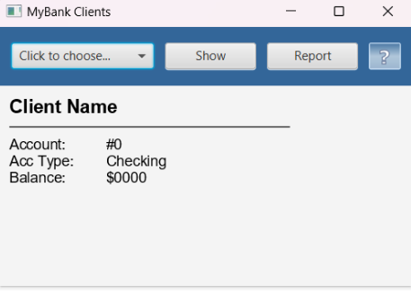
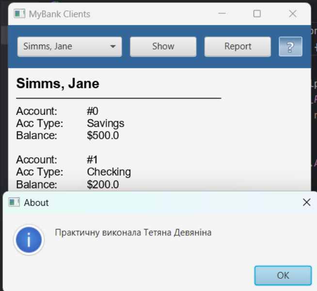
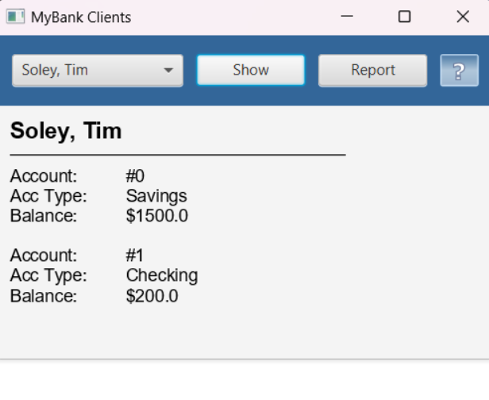
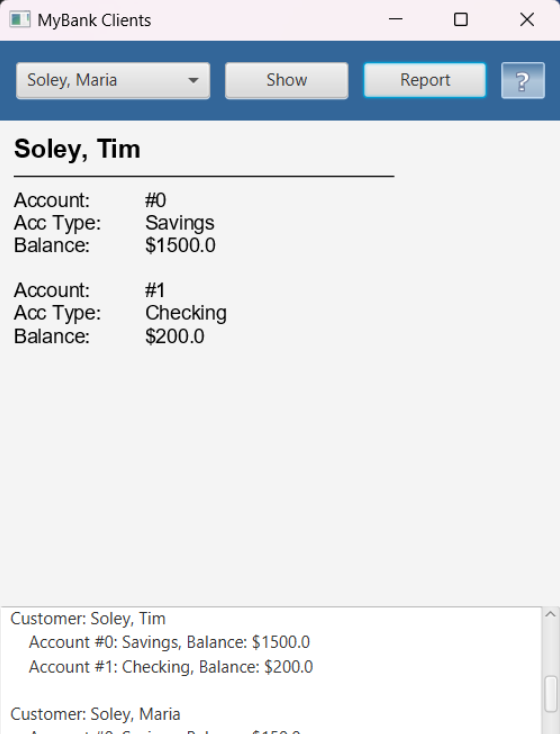

# UI Lab 5


## Скріни виконаної пр
#### 
#### 
#### 
#### 
## Код
```
import com.mybank.domain.Bank;
import com.mybank.domain.CheckingAccount;
import com.mybank.domain.SavingsAccount;
import javafx.application.Application;
import javafx.collections.FXCollections;
import javafx.collections.ObservableList;
import javafx.event.ActionEvent;
import javafx.event.EventHandler;
import javafx.geometry.Insets;
import javafx.geometry.Pos;
import javafx.scene.Scene;
import javafx.scene.control.Alert;
import javafx.scene.control.Alert.AlertType;
import javafx.scene.control.Button;
import javafx.scene.control.ComboBox;
import javafx.scene.control.TextArea;
import javafx.scene.input.MouseEvent;
import javafx.scene.layout.BorderPane;
import javafx.scene.layout.HBox;
import javafx.scene.layout.Priority;
import javafx.scene.layout.StackPane;
import javafx.scene.layout.VBox;
import javafx.scene.paint.Color;
import javafx.scene.paint.CycleMethod;
import javafx.scene.paint.LinearGradient;
import javafx.scene.paint.Stop;
import javafx.scene.shape.Line;
import javafx.scene.shape.Rectangle;
import javafx.scene.text.Font;
import javafx.scene.text.FontWeight;
import javafx.scene.text.Text;
import javafx.stage.Stage;

import java.io.BufferedReader;
import java.io.FileReader;
import java.io.IOException;

public class FXDemo extends Application {

    private Text title;
    private Text details;
    private ComboBox<String> clients;
    private TextArea reportArea;

    @Override
    public void start(Stage primaryStage) {

        loadData("data/test.dat");

        BorderPane border = new BorderPane();
        HBox hbox = addHBox();
        border.setTop(hbox);
        border.setLeft(addVBox());
        addStackPane(hbox);

        reportArea = new TextArea();
        reportArea.setEditable(false);
        reportArea.setPrefHeight(100);
        border.setBottom(reportArea);

        Scene scene = new Scene(border, 400, 350);

        primaryStage.setTitle("MyBank Clients");
        primaryStage.setScene(scene);
        primaryStage.show();
    }
    private void loadData(String filename) {
        try (BufferedReader br = new BufferedReader(new FileReader(filename))) {
            String line = br.readLine();
            int numClients = Integer.parseInt(line.trim());

            for (int i = 0; i < numClients; i++) {
                String clientInfo = br.readLine().trim();
                String[] clientData = clientInfo.split("\\s+"); // Розділити рядок за будь-якою кількістю пробілів

                if (clientData.length >= 3) { // Перевірка на кількість елементів у масиві
                    String firstName = clientData[0];
                    String lastName = clientData[1];
                    int numAccounts = Integer.parseInt(clientData[2]);

                    Bank.addCustomer(firstName, lastName);
                    int customerIndex = Bank.getNumberOfCustomers() - 1;

                    for (int j = 0; j < numAccounts; j++) {
                        line = br.readLine().trim();
                        String[] accountData = line.split("\\s+");

                        if (accountData.length >= 3) {
                            String type = accountData[0];
                            double balance = Double.parseDouble(accountData[1]);
                            double additionalInfo = Double.parseDouble(accountData[2]);

                            if (type.equals("S")) {
                                Bank.getCustomer(customerIndex).addAccount(new SavingsAccount(balance, additionalInfo));
                            } else if (type.equals("C")) {
                                Bank.getCustomer(customerIndex).addAccount(new CheckingAccount(balance, additionalInfo));
                            }
                        }
                    }
                }
            }
        } catch (IOException e) {
            e.printStackTrace();
        } catch (NumberFormatException e) {
            e.printStackTrace();
            showAlert("Error parsing data file");
        }
    }

    private void showAlert(String message) {
        Alert alert = new Alert(AlertType.ERROR);
        alert.setTitle("Error");
        alert.setHeaderText(null);
        alert.setContentText(message);
        alert.showAndWait();
    }

    public VBox addVBox() {
        VBox vbox = new VBox();
        vbox.setPadding(new Insets(10));
        vbox.setSpacing(8);

        title = new Text("Client Name");
        title.setFont(Font.font("Arial", FontWeight.BOLD, 18));
        vbox.getChildren().add(title);

        Line separator = new Line(10, 10, 280, 10);
        vbox.getChildren().add(separator);

        details = new Text("Account:\t\t#0\nAcc Type:\tChecking\nBalance:\t\t$0000");
        details.setFont(Font.font("Arial", FontWeight.NORMAL, 14));
        vbox.getChildren().add(details);

        return vbox;
    }

    public HBox addHBox() {
        HBox hbox = new HBox();
        hbox.setPadding(new Insets(15, 12, 15, 12));
        hbox.setSpacing(10);
        hbox.setStyle("-fx-background-color: #336699;");

        ObservableList<String> items = FXCollections.observableArrayList();
        for (int i = 0; i < Bank.getNumberOfCustomers(); i++) {
            items.add(Bank.getCustomer(i).getLastName() + ", " + Bank.getCustomer(i).getFirstName());
        }

        clients = new ComboBox<>(items);
        clients.setPrefSize(150, 20);
        clients.setPromptText("Click to choose...");

        Button buttonShow = new Button("Show");
        buttonShow.setPrefSize(100, 20);

        buttonShow.setOnAction(new EventHandler<ActionEvent>() {
            @Override
            public void handle(ActionEvent event) {
                try {
                    int custNo = clients.getItems().indexOf(clients.getValue());
                    if (custNo >= 0) {
                        title.setText(clients.getValue());
                        StringBuilder detailsText = new StringBuilder();
                        for (int accNo = 0; accNo < Bank.getCustomer(custNo).getNumberOfAccounts(); accNo++) {
                            String accType = Bank.getCustomer(custNo).getAccount(accNo) instanceof CheckingAccount ? "Checking" : "Savings";
                            detailsText.append("Account:\t\t#").append(accNo)
                                    .append("\nAcc Type:\t").append(accType)
                                    .append("\nBalance:\t\t$").append(Bank.getCustomer(custNo).getAccount(accNo).getBalance())
                                    .append("\n\n");
                        }
                        details.setText(detailsText.toString());
                    } else {
                        throw new Exception("You need to choose a client first!");
                    }
                } catch (Exception e) {
                    Alert alert = new Alert(AlertType.ERROR);
                    alert.setTitle("Error getting client...");
                    alert.setHeaderText(null);
                    String details = e.getMessage() != null ? e.getMessage() : "You need to choose a client first!";
                    alert.setContentText("Error details: " + details);
                    alert.showAndWait();
                }
            }
        });

        Button buttonReport = new Button("Report");
        buttonReport.setPrefSize(100, 20);
        buttonReport.setOnAction(new EventHandler<ActionEvent>() {
            @Override
            public void handle(ActionEvent event) {
                generateReport();
            }
        });

        hbox.getChildren().addAll(clients, buttonShow, buttonReport);

        return hbox;
    }

    private void generateReport() {
        StringBuilder reportText = new StringBuilder();
        for (int i = 0; i < Bank.getNumberOfCustomers(); i++) {
            reportText.append("Customer: ").append(Bank.getCustomer(i).getLastName())
                    .append(", ").append(Bank.getCustomer(i).getFirstName()).append("\n");
            for (int accNo = 0; accNo < Bank.getCustomer(i).getNumberOfAccounts(); accNo++) {
                String accType = Bank.getCustomer(i).getAccount(accNo) instanceof CheckingAccount ? "Checking" : "Savings";
                reportText.append("    Account #").append(accNo)
                        .append(": ").append(accType)
                        .append(", Balance: $").append(Bank.getCustomer(i).getAccount(accNo).getBalance()).append("\n");
            }
            reportText.append("\n");
        }
        reportArea.setText(reportText.toString());
    }

    public void addStackPane(HBox hb) {
        StackPane stack = new StackPane();
        Rectangle helpIcon = new Rectangle(30.0, 25.0);
        helpIcon.setFill(new LinearGradient(0, 0, 0, 1, true, CycleMethod.NO_CYCLE,
                new Stop[]{
                        new Stop(0, Color.web("#4977A3")),
                        new Stop(0.5, Color.web("#B0C6DA")),
                        new Stop(1, Color.web("#9CB6CF")),}));
        helpIcon.setStroke(Color.web("#D0E6FA"));
        helpIcon.setArcHeight(3.5);
        helpIcon.setArcWidth(3.5);

        Text helpText = new Text("?");
        helpText.setFont(Font.font("Verdana", FontWeight.BOLD, 18));
        helpText.setFill(Color.WHITE);
        helpText.setStroke(Color.web("#7080A0"));

        helpIcon.setOnMouseClicked(new EventHandler<MouseEvent>() {
            @Override
            public void handle(MouseEvent t) {
                ShowAboutInfo();
            }
        });

        helpText.setOnMouseClicked(new EventHandler<MouseEvent>() {
            @Override
            public void handle(MouseEvent t) {
                ShowAboutInfo();
            }
        });

        stack.getChildren().addAll(helpIcon, helpText);
        stack.setAlignment(Pos.CENTER_RIGHT);
        StackPane.setMargin(helpText, new Insets(0, 10, 0, 0));

        hb.getChildren().add(stack);
        HBox.setHgrow(stack, Priority.ALWAYS);
    }

    private void ShowAboutInfo() {
        Alert alert = new Alert(AlertType.INFORMATION);
        alert.setTitle("About");
        alert.setHeaderText(null);
        alert.setContentText("Практичну виконала Тетяна Девяніна" );
        alert.showAndWait();
    }

    public static void main(String[] args) {
        launch(args);
    }
}
```

Це одна з робіт, які доповнюють основний цикл лабораторних робіт #1-8 (проект **Banking**, [Netbeans](https://netbeans.org/)) з ООП.  Основна мета цих додаткових вправ - познайомитись з різними видами інтерфейсів користувача та засобами їх створення. Згадувані 'базові' роботи розміщено в [окремому репозиторії](https://github.com/liketaurus/OOP-JAVA) (якщо будете робити завдання на "4" або "5" раджу переглянути [діаграму класів](https://github.com/liketaurus/OOP-JAVA/blob/master/MyBank.png), аби розуміти які методи є у класів).

В ході цієї роботи вам пропонується виконати **наступне завдання** - [Робота 5: GUI з JavaFX](https://github.com/ppc-ntu-khpi/GUI-Lab3-Starter/blob/master/Lab%205%20-%20JavaFX/Lab%205.md)
  
**Додаткове завдання** (для тих хто зробив все і прагне більшого): [дивіться тут](https://github.com/ppc-ntu-khpi/GUI-Lab3-Starter/blob/master/Lab%205%20-%20JavaFX/Lab%20-%205%20-%20add.md)

Всі необхідні бібліотеки містяться у теці [jars](https://github.com/ppc-ntu-khpi/GUI-Lab3-Starter/tree/master/jars). В тому числі - всі необхідні відкомпільовані класи з робіт 1-8 - файл [MyBank.jar](https://github.com/ppc-ntu-khpi/GUI-Lab3-Starter/blob/master/jars/MyBank.jar). Файл даних лежить у теці [data](https://github.com/ppc-ntu-khpi/GUI-Lab3-Starter/tree/master/data).

---
**УВАГА! Не забуваємо здавати завдання через Google Classroom та вказувати посилання на створений для вас репозиторій!**

Також пам'ятайте, що ніхто не заважає вам редагувати файл README у вашому репозиторії😉.
А ще - дуже раджу спробувати нову фічу - інтеграцію з IDE REPL.it (хоч з таким завданням вона може й не впоратись, однак, цікаво ж!).

[](https://gitter.im/PPC-SE-2020/OOP?utm_source=badge&utm_medium=badge&utm_campaign=pr-badge)


 
